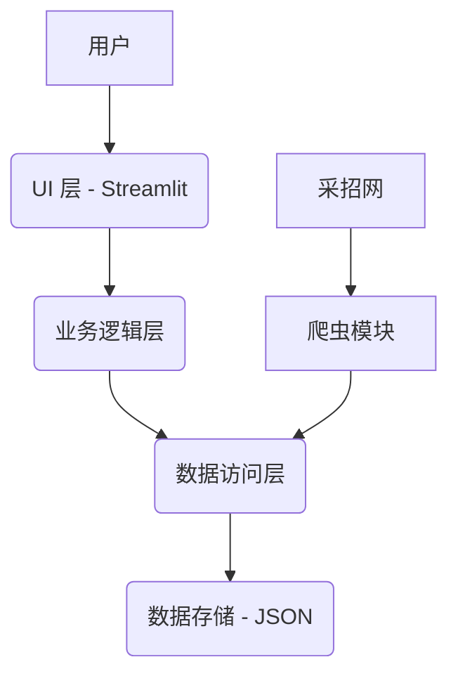

# 招投标信息监控系统 (Bidding Crawler) - 项目规格说明

> **版本**: 1.3.0
> **最后更新**: 2026-02-06
> **作者**: Manus AI

---

## 1. 项目概述

### 1.1. 项目名称

招投标信息监控系统 (Bidding Crawler)

### 1.2. 项目目标

本项目旨在为特定企业用户自动化监控中国政府采购网站上的招投标信息。系统通过爬取、过滤和展示相关公告，帮助用户及时发现商业机会，替代传统的人工监控方式，提高效率和准确性。

### 1.3. 核心功能

- **数据爬取**: 从指定的政府采购网站（采招网）抓取招投标公告列表。
- **关键词过滤**: 根据预设的关键词（如：广告、标识、宣传）在标题、内容和附件中进行匹配和筛选。
- **数据处理**: 清洗、去重，并提取关键字段，如项目标题、发布日期、业主单位、预算金额等。
- **详情提取**: 访问项目详情页，抓取业主单位、项目地址等补充信息。
- **Web 界面**: 使用 Streamlit 搭建一个交互式的前端页面，用于展示、筛选、排序和导出数据。
- **自动更新**: 过滤已过期的项目，并支持未来扩展为定时自动更新。

### 1.4. 目标用户

需要实时获取特定领域（如广告、文化建设）招投标信息的企业或个人，主要应用场景是业务拓展和市场监控。

---

## 2. 功能需求

### 2.1. 数据爬取

| 需求 ID | 需求描述 | 优先级 | 状态 |
|---|---|---|---|
| F-CRAWL-01 | 必须能从采招网（bidcenter.com.cn）的四川省分类下抓取“招标公告”。 | 高 | ✅ 已实现 |
| F-CRAWL-02 | 爬虫需要能够绕过网站的人机验证机制。 | 高 | ✅ 已实现 |
| F-CRAWL-03 | 能够从列表页提取每个项目的详情页链接（`detail_url`）。 | 高 | ✅ 已实现 |
| F-CRAWL-04 | 能够从详情页提取**业主单位**和**项目地址**。 | 高 | ✅ 部分实现 |
| F-CRAWL-05 | 能够识别并标记项目中匹配到的关键词。 | 中 | ⏳ 待实现 |

### 2.2. 数据处理与过滤

| 需求 ID | 需求描述 | 优先级 | 状态 |
|---|---|---|---|
| F-PROC-01 | 系统必须能根据预设关键词列表过滤项目。 | 高 | ✅ 已实现 |
| F-PROC-02 | 必须自动过滤掉“中标结果”类公告，只保留“招标公告”。 | 高 | ✅ 已实现 |
| F-PROC-03 | 必须自动过滤掉投标截止日期已过的项目。 | 高 | ✅ 已实现 |
| F-PROC-04 | 新抓取的数据必须与历史数据进行合并，并去除重复项。 | 高 | ✅ 已实现 |

### 2.3. 数据存储

| 需求 ID | 需求描述 | 优先级 | 状态 |
|---|---|---|---|
| F-STORE-01 | 项目数据需要以结构化形式存储。当前使用 JSON 文件。 | 高 | ✅ 已实现 |
| F-STORE-02 | 数据模型应包含项目的所有关键字段。 | 高 | ✅ 已实现 |
| F-STORE-03 | （未来）考虑将数据存储迁移到 PostgreSQL 数据库，以提高性能和可扩展性。 | 低 | 📝 计划中 |

### 2.4. Web 界面 (UI)

| 需求 ID | 需求描述 | 优先级 | 状态 |
|---|---|---|---|
| F-UI-01 | 提供一个 Web 界面来展示所有符合条件的项目列表。 | 高 | ✅ 已实现 |
| F-UI-02 | 列表应包含关键信息：标题、发布日期、截止日期、业主单位、项目地址。 | 高 | ✅ 已实现 |
| F-UI-03 | 用户应能通过关键词在界面上进行二次筛选。 | 中 | ✅ 已实现 |
| F-UI-04 | 界面应展示关键统计数据，如项目总数、本周新增等。 | 中 | ✅ 已实现 |
| F-UI-05 | 用户能够将筛选后的数据导出为 Excel 或 CSV 文件。 | 中 | ✅ 已实现 |

---

## 3. 系统架构

### 3.1. 高层架构

本项目采用经典的分层架构，将系统解耦为四个主要层次：



- **UI 层 (User Interface)**: 负责与用户交互，展示数据和接收用户输入。使用 Streamlit 构建。
- **业务逻辑层 (Business Logic)**: 包含核心业务规则，如数据过滤、统计和处理。
- **数据访问层 (Data Access)**: 负责数据的读取和写入，将业务逻辑与具体的数据存储方式（JSON）解耦。
- **爬虫模块 (Crawler)**: 负责从外部网站抓取原始 HTML 数据。

### 3.2. 技术栈

| 类别 | 技术 | 用途 |
|---|---|---|
| 编程语言 | Python 3.11 | 主要开发语言 |
| Web 框架 | Streamlit | 构建交互式 Web UI |
| 数据处理 | Pandas | 数据清洗、转换和分析 |
| HTML 解析 | BeautifulSoup4 | 从 HTML 中提取数据 |
| HTTP 请求 | Requests | 与 Web 服务进行通信 |
| 测试框架 | Pytest | 单元测试和集成测试 |
| 日志 | Structlog | 结构化日志记录 |

---

## 4. 数据规格

### 4.1. 数据源

- **网站**: 采招网 (bidcenter.com.cn)
- **目标页面**: 四川省招标公告搜索结果页
- **URL**: `https://user.bidcenter.com.cn/v2023/#/des/customDesSearch/...`

### 4.2. 数据模型 (Data Schema)

核心数据实体为 `BiddingInfo`，定义在 `src/data/models.py` 中。其主要字段如下：

| 字段名 | 数据类型 | 描述 | 示例 |
|---|---|---|---|
| `project_id` | String | 项目的唯一标识符 | `404192669` |
| `title` | String | 项目完整标题 | `内江市第二人民医院就内江市第二人民医院所需宣传服务采购项目` |
| `info_type` | String | 信息类型 | `招标公告` |
| `publish_date` | Date | 发布日期 | `2026-02-03` |
| `bidding_deadline` | Datetime | 投标截止时间 | `2026-02-10 17:00` |
| `owner_unit` | String | 业主单位/采购人 | `内江市第二人民医院` |
| `project_address` | String | 项目实施地址 | `四川省内江市市中区` |
| `budget_amount` | String | 预算金额 | `15万元` |
| `procurement_type` | String | 采购方式 | `院内招标` |
| `keywords_matched` | List[String] | 匹配到的关键词列表 | `["宣传"]` |
| `detail_url` | String | 详情页的直接链接 | `https://www.bidcenter.com.cn/news-404192669-1.html` |

### 4.3. 数据样本

数据存储在 `data/bidding_data.json` 文件中，格式为 JSON 数组。单个项目示例如下：

```json
{
  "project_id": "404192669",
  "title": "内江市第二人民医院就内江市第二人民医院所需宣传服务采购项目",
  "info_type": "招标公告",
  "publish_date": "2026-02-03",
  "keywords_matched": [
    "宣传"
  ],
  "keyword_location_tag": "宣传在标题中",
  "detail_url": "https://www.bidcenter.com.cn/news-404192669-1.html",
  "city": "内江",
  "owner_unit": "内江市第二人民医院",
  "budget_amount": "15万元",
  "procurement_type": "院内招标",
  "bidding_deadline": "2026-02-10T17:00:00",
  "project_address": "四川省内江市市中区"
}
```

---

## 5. 实现细节

### 5.1. 项目结构

```
/home/ubuntu/bidding-crawler/
├── .streamlit/config.toml       # Streamlit 配置文件
├── data/bidding_data.json       # 数据存储文件
├── src/
│   ├── crawler/                 # 爬虫模块
│   ├── data/                    # 数据处理模块 (模型、存储、匹配)
│   └── ui/app.py                # Streamlit 应用主文件
├── extract_detail_page.py       # 详情页提取脚本
├── merge_and_clean_data.py      # 数据合并与清洗脚本
├── parse_html.py                # 列表页解析脚本
├── requirements.txt             # Python 依赖
└── README.md                    # 项目说明
```

### 5.2. 关键脚本

- **`parse_html.py`**: 负责解析从浏览器复制的 HTML 列表页内容，提取初步的项目信息和错误的详情页链接。
- **`extract_detail_page.py`**: 接收项目 ID，访问真实的详情页，提取**业主单位**和**项目地址**等详细信息。
- **`merge_and_clean_data.py`**: 合并新旧数据，根据 `project_id` 去重，并过滤掉已过期的和非“招标公告”类型的项目。
- **`src/ui/app.py`**: Streamlit 应用的入口，负责加载数据、渲染页面、处理用户交互和数据导出。

### 5.3. 爬虫策略

由于目标网站存在人机验证，项目当前采用**半自动化**的爬虫策略：

1.  **手动获取列表页**: 使用浏览器访问搜索结果页，手动滚动加载所有数据后，将页面 HTML 保存或复制。
2.  **自动化解析**: 运行 `parse_html.py` 解析 HTML，提取项目列表。
3.  **自动化提取详情**: 遍历列表，运行 `extract_detail_page.py` 补充每个项目的详细信息。

这种方式有效绕过了反爬虫机制，保证了数据获取的稳定性。

---

## 6. 部署与运维

### 6.1. 本地运行

1.  **安装依赖**: `pip install -r requirements.txt`
2.  **运行爬虫**: 按需执行 `parse_html.py`, `extract_detail_page.py` 等脚本更新 `data/bidding_data.json`。
3.  **启动 UI**: `streamlit run src/ui/app.py`

### 6.2. 永久部署 (Streamlit Cloud)

项目已配置为可以一键部署到 Streamlit Cloud。

- **仓库**: `DivenYoung/bidding-crawler`
- **分支**: `main`
- **主文件**: `src/ui/app.py`

部署后，任何推送到 `main` 分支的提交（尤其是对 `data/bidding_data.json` 的更新）都会触发自动重新部署，实现网站内容的更新。

---

## 7. 路线图 (Roadmap)

- **V1.4**: 
  - [ ] 实现 `matched_keywords` 字段的提取逻辑。
  - [ ] 将爬虫和数据处理流程整合为一个完整的自动化脚本。
  - [ ] 添加定时任务，实现每日自动更新。
- **V2.0**:
  - [ ] 将数据存储从 JSON 迁移到 PostgreSQL。
  - [ ] 引入邮件或企业微信通知功能。
  - [ ] 探索更智能的关键词匹配（如 NLP）。
